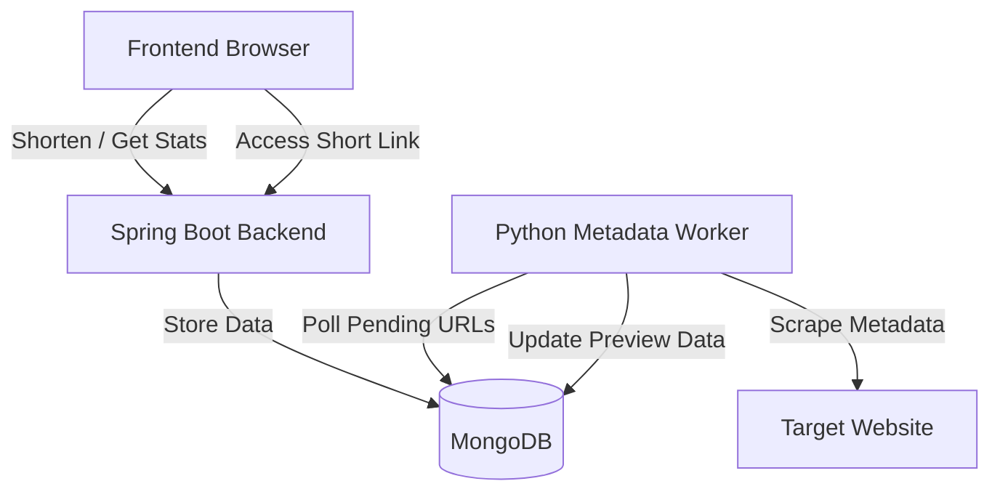

# Urllink — Premium URL Shortener & Analytics

Urly is a modern, high-performance, and feature-rich URL shortener. It includes dynamic web scraping for link previews, detailed real-time click analytics with interactive charts, QR code generation, and a gorgeous glassmorphism UI.

---

## 🚀 Key Features

- **Custom Short Links:** Generate clean random short codes or specify custom aliases.
- **Dynamic Site Preview:** Automatically scrapes target page titles, descriptions, and favicons in the background.
- **Detailed Analytics Dashboard:**
  - Visual timeline chart showing click frequency over time.
  - Recent click log tracking IP addresses, User-Agents, and timestamps.
  - Active click counters with real-time updates.
- **QR Code Generation:** Generate instant high-quality QR codes for every shortened URL with download capabilities.
- **Premium Glassmorphism Design:** A beautiful dark-themed interface built using CSS custom variables and modern responsive grids.

---

## 🛠️ Technology Stack

- **Core & Backend:** Java 21 / Spring Boot 3.x
- **Database:** MongoDB
- **Async Scraper Worker:** Python 3 (BeautifulSoup4 & requests)
- **Frontend:** Vanilla HTML5 / modern CSS3 / JavaScript (with Chart.js & QRCode.js)
- **Deployment:** Docker & Render YAML Blueprint support

---

## 🏗️ Architecture



---

## ⚙️ Configuration & Environment Variables

Both the backend and python worker use environment variables, allowing them to switch seamlessly between local development and cloud production.

| Variable Name | Description | Default Value (Local) |
|---|---|---|
| `MONGODB_URI` | Connection URI for the MongoDB database | `mongodb://localhost:27017/urly` |
| `APP_BASE_URL` | Base URL used to construct short links | `http://localhost:8080` |

---

## 💻 Local Setup Instructions

### 1. Requirements
Ensure you have the following installed locally:
- Java 21 JDK
- Maven
- Python 3.10+
- MongoDB

### 2. Running the Spring Boot Backend
From the project root:
```bash
./mvnw spring-boot:run
```
The server will start on `http://localhost:8080`.

### 3. Running the Python Scraper Worker
Install Python dependencies and run the worker:
```bash
cd python_worker
pip install -r requirements.txt
python metadata_worker.py
```

---

## ☁️ Cloud Deployment (Render + MongoDB Atlas)

This repository includes a `render.yaml` blueprint to make cloud deployment completely hands-off.

1. Sign up on **[MongoDB Atlas](https://mongodb.com/atlas)** and create a free M0 cluster.
2. In **Network Access**, add IP `0.0.0.0/0` (allows cloud connection).
3. Copy your connection string: `mongodb+srv://<username>:<password>@yourcluster.mongodb.net/urly`
4. Log into **[Render](https://render.com)** using your GitHub account.
5. Click **New** → **Blueprint** → Select your **Urly** repository.
6. Provide the environment variables:
   - `MONGODB_URI`: *Your MongoDB Atlas connection string*
   - `APP_BASE_URL`: *The URL of your deployed Render Web Service*
7. Render will automatically build the Spring Boot Web Service and spin up the Python Background Worker.
